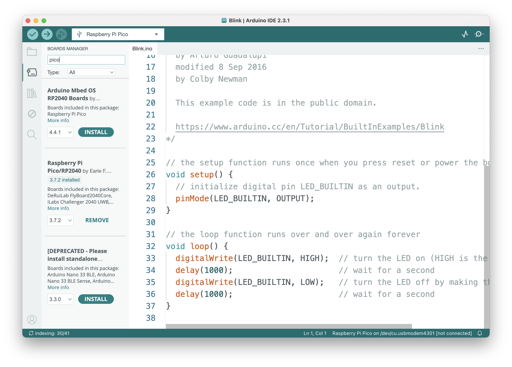
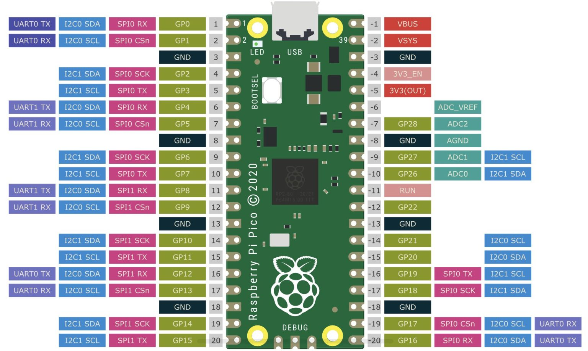
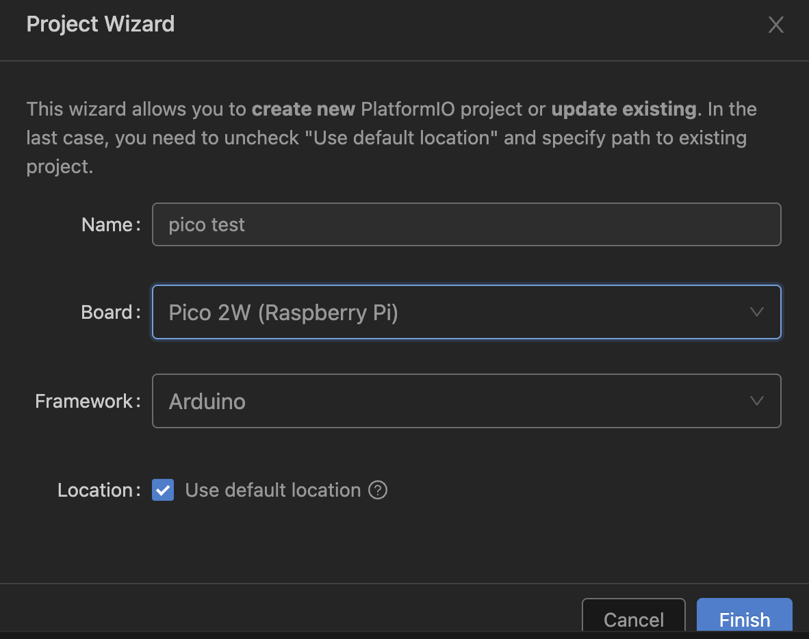

## introduction
There are many types of microcontroller around in the Maker- and Creative Technology realm. Most people get started with Arduino (Uno) because of the level of documentation, ease of use and balanced (not overwhelming) amount of features. Your Arduino is however just the tip of the iceberg, there are many alternatives around with different price tag, more performance and peripherals, even up to the point where they are bridging the devide between 'microcontroller' and fully fledged computer [^1]. 

As follow up we take a look at the [RPi pico 2W](https://www.raspberrypi.com/products/raspberry-pi-pico-2/). This controller by the Raspberry Pi group has 2 cores, 8 peripheral controllers, runs at 150 MHz, 32 bits- and is [VERY WELL documented](https://datasheets.raspberrypi.com/picow/pico-2-w-datasheet.pdf). The latter has been the most compelling argument for us to move to the pico instead of widespread ESP32 controllers. Since the price tag is not the issue (picos are much cheaper than Arduinos) we believe we can 'up your game' considerably by introducing these. The Pico 2W also has everything on board for wireless (bluetooth, WIFI) communication. 

## getting started
The easiest way to get started with programming the pico is using the [Arduino environment](https://www.arduino.cc/en/software/). Simply download a board definition for RPi Pico (select from the board manager) and install the board definitions for pico / RP2040 by Earle F. Philhower, III. Do *not* install the version for MBED OS or the DEPRECATED Nano 33 BLE sense edition. They are not well/not longer supported. *(so, see the following figure: the middle option is the right one)*

In order for these definitions to show up, you have to add the line
```
https://github.com/earlephilhower/arduino-pico/releases/download/global/package_rp2040_index.json
```
to the 'Additional Board Managar URL's' setting in Arduino's setting pane. More about EarlPhilhowwer's port can be found [here](https://github.com/earlephilhower/arduino-pico).



Note that the board (definitions) also come with a great library of functions. Using Earle F. Philhower's Arduino framework for Pico, you can use most of the existing Arduino functions digital/analog read/write, Serial.print, millis(), etc) and many others. Most notably there is the option for using setup1() and loop1() to run processes on the other core.. how cool is that!



A close inspection of the pico shows that it has a few more pins (than an Arduino), and that most of the pins also have specific hardware options (such as I2C or Serial communication) available. Also, very important, **the pico works at 3.3V**, so you cannot use your older 5V hardware and sensors without adaptation. 

### uploading programs
Next up you should be able to compile and load a blinky. Make sure you select the good port and board. Note that the way of programming the pico (under water) works differently. It will register as UF2 device (like a USB stick or memory device) and software is programmed on by 'copying' this to the device. The pico needs to reset to make this work, which can be done automagically through a serial port. However, at first (when nobody has ever touched it) there is no serial port 'programmed on'. So. for (at least) the first-time programming, you need to press and hold the BOOTSEL button on the pico while plugging it in. This makes the pico behave as UF2 memory device, recognised by your system and Arduino will detect and use it. This is also fall-back behaviour if you screwed up programming and Arduino IDE and pico refuse to talk to each other. 

When one of the subsequent Arduino sketches included a serial port, next time when you program the board, Arduino can reset it for you (when the correct usb serial port is selected) and you do not need to push the button again.

### setting up VScode
when programs are getting bigger and/or you have to collaborate with more students on one bit of software, it might be a good idea to abandon the simple Arduino IDE environment and move to VScode. VScode has been developed by Microsoft, but is widely used cross-platform (macos, linux too) as programming environment, most notably for its integration with git (version managament) multi language support (C, C++, java, python, css, html, you name it) and integration with embedded platforms (AVR, ESP, RP2040) through platform.io

Tha latter is a set of tools necessary to compile and build software for embedded platforms, as well as debug and program. 

- download and install [VScode](https://code.visualstudio.com/download)
- download and install [platform.io](https://platformio.org/install/ide?install=vscode) (might take a while)
- use platform.io Home tool (alien icon) to start a new (test) project.



- you find a directory with files to the left, instead of the .ino file you get a 'main.cpp' containing your void setup() and void loop().
![[Pasted image 20250826154945.png]]
- in your project the important configuration file is *platformio.ini* This file will be edited by the PIO Home tool (for example, library paths will be added) but it is important to add the following settings to make VScode talk with your Pico 2W: The project wizard generates one for you with the following settings: 
```
[env:rpipico2w]
platform = raspberrypi
board = rpipico2w
framework = arduino
```
   These settings will work, but your code will have to rely on functions in the pico SDK. When you want to use the functions you have used before (such as digitalWrite(), digitalRead(), millis()) you can include the 'arduino framework', ported by Earl Philhower once more. You can do this by adding/replacing the following lines to the platformio.ini file: 
```
[env:rpipico2w]
platform = https://github.com/maxgerhardt/platform-raspberrypi.git
board = rpipico2w
board_build.core = earlephilhower
framework = arduino
board_build.filesystem_size = 0.5m  
build_flags = -DDEFAULT_MTU=1400
; lib_deps =
; these are added by PIO home when you use it to add libaries. 
```
- libraries can be also installed by the platform.io home tool but you can also install them by copying the source (.cpp) file in the *src* directory and the header files (.h) in the *include* directory.
- Also very important and easily overlooked: the Arduino functions are available (when you use the earlephilhower build core) but not automatically available. You need to `#include <Arduino.h>` to use this library at the top of your code. 

Way below in the bar you will find buttons for building and uploading the code (same icons as used with Arduino). The tick mark ✓ is for checking and compiling, the arrow → is for uploading.


>Typically VScode is a bit faster in the whole compiling, linking and uploading code than Arduino IDE, because it will leave pre(viously) compiled code as is, and will just link the newly compiled bits you added. Arduino IDE will always compile EVERYTHING, which takes up some time. This behaviour also means that when you mess around with dependencies, added new libraries or made big changes throughout the code, it is wise to start 'fresh'. You can do this by hitting the thrash button 🗑︎ next to the right arrow. This will remove all pre-compiled code and start anew. 

### Serial monitor
A (very simple) serial terminal is present by default, but a slightly more userfriendly version can be added as plug-in (extension) in VScode. Search for 'Serial Monitor' and you'll find one by microsoft. There are many useful extensions such as support for Git, co-pilot, Python, web development, etc. 

## troubleshooting
- when your program fails to upload, check the serial port - and when it does not show up (use Arduino IDE for example to check, or install a Serial Monitor extension in VScode). Try again (press bootsel button WHILE you are plugging in the board and THEN release the button)
- There is a difference between pico, pico2 and pico 2W. Make sure to check you setup your toolchain in correspondence with your board!
- 


[^1]: playing Doom was originally reserved to (IBM) computers but has been ported to any embedded controller, from the WHY2025 badge to electronic toothbrushes. 
